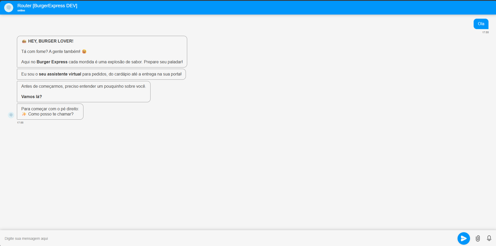
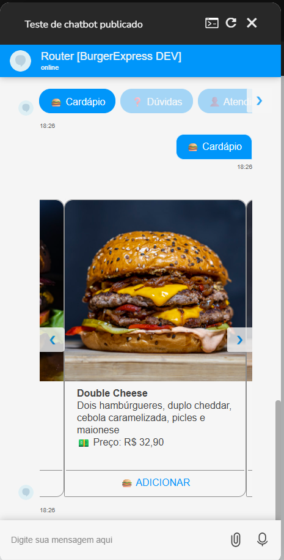
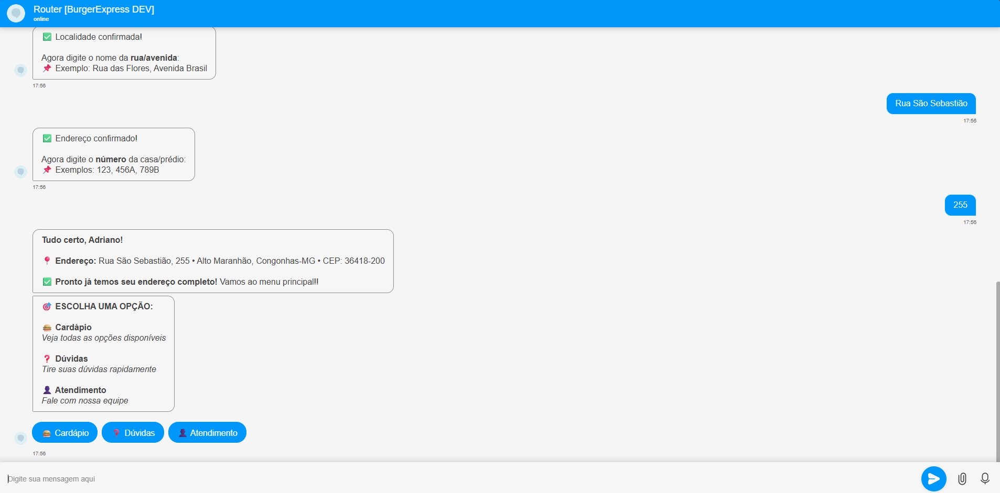
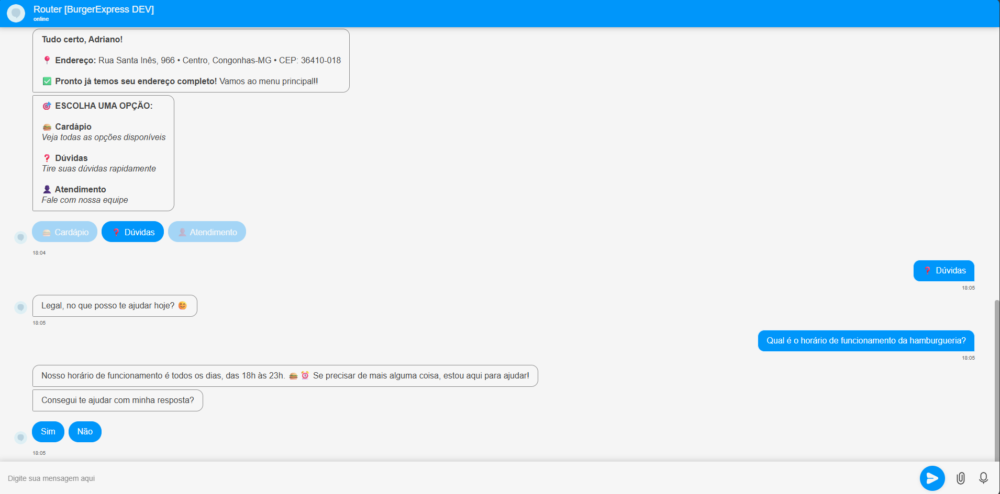

# 🍔 Chatbot Inteligente para Hamburgueria (Burger Express)

Sistema completo de atendimento automatizado para uma hamburgueria, desenvolvido com foco em **experiência do usuário**, **automação de processos** e **integração inteligente entre bot, IA e atendimento humano**.

O chatbot centraliza pedidos, dúvidas e direcionamento de clientes, reduzindo o tempo de atendimento e aumentando a eficiência operacional.

---

## 🚀 Funcionalidades

- 📋 **Menu interativo com carrossel de produtos**
- 📍 **Validação de CEP em tempo real** para verificação de área de entrega
- 🤖 **Agente de IA** para responder dúvidas frequentes dos clientes
- 👤 **Handoff para atendimento humano** quando necessário
- 🧠 Controle de **estado e contexto da conversa**
- 🔁 Fluxos organizados e reutilizáveis

---

## 🧩 Arquitetura do Projeto

O projeto foi desenvolvido utilizando a plataforma **Blip**, com lógica personalizada em **JavaScript**, integrando APIs externas para validações e utilizando agentes de IA para respostas dinâmicas.

Componentes principais:
- Fluxos conversacionais
- Payloads dinâmicos (menus e carrosséis)
- Integrações via API REST
- Estratégia de fallback e transferência para humano
---

## 🛠️ Tecnologias Utilizadas

- **Blip**
- **JavaScript**
- **Agentes de IA**
- **API REST**
- **JSON**
- **Automação de Atendimento**

---

## 📸 Demonstração

### Menu Principal

### Carrossel de Produtos

### Validação de CEP

### Agente de IA

---

